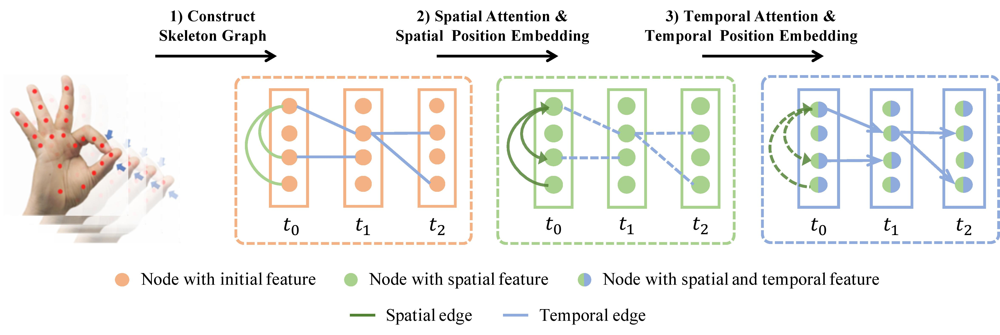

# Construct Dynamic Graphs for Hand Gesture Recognition via Spatial-Temporal Attention

This repository holds the Pytorch implementation of [Construct Dynamic Graphs for Hand Gesture Recognition via Spatial-Temporal Attention](https://arxiv.org/abs/1907.08871) by Yuxiao Chen, Long Zhao, Xi Peng, Jianbo Yuan, and Dimitris N. Metaxas.

## Introduction

We propose a Dynamic Graph-Based Spatial-Temporal Attention (DG-STA) method for hand gesture recognition. The key idea is to first construct a fully-connected graph from a hand skeleton, where the node features and edges are then automatically learned via a self-attention mechanism that performs in both spatial and temporal domains. The code of training our approach for skeleton-based hand gesture recognition on the [DHG-14/28 Dataset](http://www-rech.telecom-lille.fr/DHGdataset/) and the [SHREC’17 Track Dataset](http://www-rech.telecom-lille.fr/shrec2017-hand/) is provided in this repository.
<p align="center"></p>

### Prerequisites

This package has the following requirements:

* `Python 3.6`
* `Pytorch v1.0.1`

### Training
1. Download the [DHG-14/28 Dataset](http://www-rech.telecom-lille.fr/DHGdataset/) or the [SHREC’17 Track Dataset](http://www-rech.telecom-lille.fr/shrec2017-hand/).

2. Set the path to your downloaded dataset folder in the ```/util/DHG_parse_data.py (line 2)``` or ```the /util/SHREC_parse_data.py (line 5)```.

3. Set the path for saving your trained models in the ```train_on_DHG.py (line 117)``` or the ```train_on_SHREC.py (line 109) ```.

4. Run one of following commands.
```
python train_on_SHREC.py       # on SHREC’17 Track Dataset
python train_on_DHC.py         # on DHG-14/28 Dataset
```
### Citation
If you find this code useful in your research, please consider citing:
```
@inproceedings{chenBMVC19dynamic,
  author    = {Chen, Yuxiao and Zhao, Long and Peng, Xi and Yuan, Jianbo and Metaxas, Dimitris N.},
  title     = {Construct Dynamic Graphs for Hand Gesture Recognition via Spatial-Temporal Attention},
  booktitle = {BMVC},
  year      = {2019}
}
```
## Acknowledgement

Part of our code is borrowed from the [pytorch implementation of Transformer](http://nlp.seas.harvard.edu/2018/04/03/attention.html). We thank to the authors for releasing their codes.
